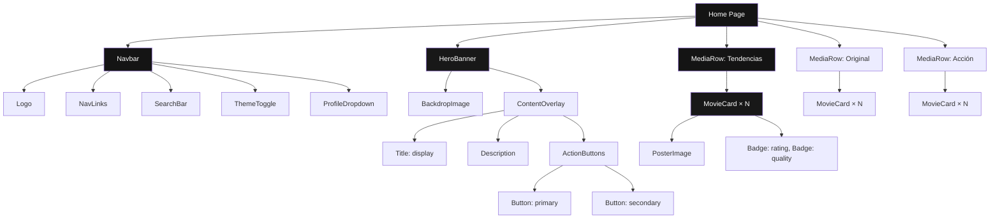
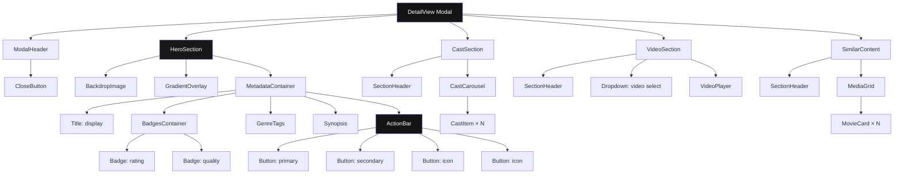

# Wireframes - Netflix-like UI

Wireframes anotados de las páginas principales (Home y Detail) utilizando shadcn/ui y Tailwind CSS.

---

## Tabla de Contenidos

- [Home Page](#home-page)
  - [Wireframe ASCII](#wireframe-ascii-home)
  - [Component Tree Mermaid](#component-tree-mermaid-home)
  - [Leyenda de Componentes](#leyenda-de-componentes-home)
  - [Interacciones](#interacciones-home)
- [Detail View (Modal)](#detail-view-modal)
  - [Wireframe ASCII](#wireframe-ascii-detail)
  - [Component Tree Mermaid](#component-tree-mermaid-detail)
  - [Leyenda de Componentes](#leyenda-de-componentes-detail)
  - [Interacciones](#interacciones-detail)
- [Criterios de Legibilidad - Dark Mode](#criterios-de-legibilidad-dark-mode)

---

## Home Page

### Wireframe ASCII - Home

```
┌──────────────────────────────────────────────────────────────────────────────┐
│                                                                              │
│  ┌────────────────────────────────────────────────────────────────────────┐│
│  │  LOGO      Home    Películas    Series    [🔍 Buscar...]     🌙 @User   ││  ← Navbar (fixed)
│  └────────────────────────────────────────────────────────────────────────┘│
│                                                                              │
│  ┌────────────────────────────────────────────────────────────────────────┐│
│  │                                                                      ←  ││  ← Carousel arrows
│  │   ╔═════════════════════════════════════════════════════════════════╗   ││
│  │   ║                                                                   ║   ││
│  │   ║      ▁▁▁▁▁▁▁▁▁▁▁▁▁▁▁▁▁▁▁▁▁▁▁▁▁▁▁▁▁▁▁▁▁▁▁▁▁▁▁▁▁▁▁▁▁▁▁▁▁▁▁▁      ║   ││  ← HeroBanner
│  │   ║     ▒░░░░░░░░░░░░░░░░░░░░░░░░░░░░░░░░░░░░░░░░░░░░░░░░░░░░░░░░▒     ║   ││    (featured movie)
│  │   ║    ▒▒▒  [TÍTULO HERO]  ━━━━━━━━━━━━━━━━━━━━━  ★ 8.5  ▒▒▒    ║   ││
│  │   ║     ▒  Descripción destacada del contenido principal...          ▒   ║   ││
│  │   ║      ▒                                                          ▒   ║   ││
│  │   ║       ▒         [▶ Reproducir]  [ℹ Más información]            ▒   ║   ││
│  │   ║        ▒                                                        ▒   ║   ││
│  │   ╚═════════════════════════════════════════════════════════════════╝   ││
│  │                                                                      →  ││
│  └────────────────────────────────────────────────────────────────────────┘│
│                                                                              │
│  ┌────────────────────────────────────────────────────────────────────────┐│
│  │  Tendencias ahora                                                    ←→ ││
│  ├────────────────────────────────────────────────────────────────────────┤│
│  │  ┌─────┐ ┌─────┐ ┌─────┐ ┌─────┐ ┌─────┐ ┌─────┐ ┌─────┐ ┌─────┐     ││
│  │  │POST │ │POST │ │POST │ │POST │ │POST │ │POST │ │POST │ │POST │     ││  ← MediaRow (horizontal)
│  │  │ER   │ │ER   │ │ER   │ │ER   │ │ER   │ │ER   │ │ER   │ │ER   │     ││    (Trending row)
│  │  │     │ │     │ │     │ │     │ │     │ │     │ │     │ │     │     ││
│  │  └─────┘ └─────┘ └─────┘ └─────┘ └─────┘ └─────┘ └─────┘ └─────┘     ││
│  │  ┌─────┐ ┌─────┐ ┌─────┐ ┌─────┐ ┌─────┐ ┌─────┐ ┌─────┐ ┌─────┐     ││
│  │  │POST │ │POST │ │POST │ │POST │ │POST │ │POST │ │POST │ │POST │     ││
│  │  │ER   │ │ER   │ │ER   │ │ER   │ │ER   │ │ER   │ │ER   │ │ER   │     ││
│  │  │     │ │     │ │     │ │     │ │     │ │     │ │     │ │     │     ││
│  │  └─────┘ └─────┘ └─────┘ └─────┘ └─────┘ └─────┘ └─────┘ └─────┘     ││
│  └────────────────────────────────────────────────────────────────────────┘│
│                                                                              │
│  ┌────────────────────────────────────────────────────────────────────────┐│
│  │  Original de Netflix                                                 ←→ ││
│  ├────────────────────────────────────────────────────────────────────────┤│
│  │  ┌─────┐ ┌─────┐ ┌─────┐ ┌─────┐ ┌─────┐ ┌─────┐ ┌─────┐ ┌─────┐     ││  ← MediaRow
│  │  │POST │ │POST │ │POST │ │POST │ │POST │ │POST │ │POST │ │POST │     ││
│  │  │ER   │ │ER   │ │ER   │ │ER   │ │ER   │ │ER   │ │ER   │ │ER   │     ││
│  │  │     │ │     │ │     │ │     │ │     │ │     │ │     │ │     │     ││
│  │  └─────┘ └─────┘ └─────┘ └─────┘ └─────┘ └─────┘ └─────┘ └─────┘     ││
│  └────────────────────────────────────────────────────────────────────────┘│
│                                                                              │
│  ┌────────────────────────────────────────────────────────────────────────┐│
│  │  Acción y Aventura                                                    ←→ ││
│  ├────────────────────────────────────────────────────────────────────────┤│
│  │  ┌─────┐ ┌─────┐ ┌─────┐ ┌─────┐ ┌─────┐ ┌─────┐ ┌─────┐ ┌─────┐     ││  ← MediaRow
│  │  │POST │ │POST │ │POST │ │POST │ │POST │ │POST │ │POST │ │POST │     ││
│  │  │ER   │ │ER   │ │ER   │ │ER   │ │ER   │ │ER   │ │ER   │ │ER   │     ││
│  │  │     │ │     │ │     │ │     │ │     │ │     │ │     │ │     │     ││
│  │  └─────┘ └─────┘ └─────┘ └─────┘ └─────┘ └─────┘ └─────┘ └─────┘     ││
│  └────────────────────────────────────────────────────────────────────────┘│
│                                                                              │
└──────────────────────────────────────────────────────────────────────────────┘
```

---

### Component Tree Mermaid - Home



---

### Leyenda de Componentes - Home

| Componente | Descripción | Props Clave | Estado Loading |
|------------|-------------|-------------|-----------------|
| **Navbar** | Navegación fija top con gradiente | `logo`, `links[]`, `theme` | Skeleton logo, pulse links |
| **SearchBar** | Input con debounce | `placeholder`, `onSearch` | Shimmer input |
| **HeroBanner** | Banner destacado full width | `media`, `loading` | Hero skeleton with shimmer |
| **MediaRow** | Carousel horizontal scroll | `title`, `mediaList[]`, `loading` | Row de skeleton cards |
| **MovieCard** | Card de película/serie | `media`, `variant`, `onClick` | Poster shimmer, pulse metadata |

---

### Interacciones - Home

| Elemento | Evento | Acción | Animación |
|-----------|--------|--------|-----------|
| **Navbar links** | Hover | Underline slide-in | `transition-colors 200ms` |
| **Search input** | Focus | Expand input, show results | `transition-width 300ms` |
| **Hero - Reproducir** | Click | Abrir player o navigate a detail | Button press scale 0.95 |
| **Hero - Más info** | Click | Abrir Detail modal | Fade in modal |
| **Carousel arrows** | Click | Scroll horizontal | Smooth scroll 500ms |
| **MovieCard** | Hover | Scale 1.05, show play button | `transform 200ms ease` |
| **MovieCard** | Click | Abrir Detail modal | Modal fade in 300ms |
| **Theme toggle** | Click | Toggle dark/light | Color transition 300ms |

---

## Detail View (Modal)

### Wireframe ASCII - Detail

```
┌──────────────────────────────────────────────────────────────────────────────┐
│  ┌────────────────────────────────────────────────────────────────────────┐ │
│  │                            ┌─────┐                               │ │
│  │  DETALLE                    │  ✕  │  ← Close button (icon variant) │ │
│  │                           └─────┘                               │ │
│  └────────────────────────────────────────────────────────────────────────┘ │
│                                                                              │
│  ┌────────────────────────────────────────────────────────────────────────┐│
│  │                                                                          ││
│  │      ╔═════════════════════════════════════════════════════════════╗    ││
│  │      ║                                                               ║    ││
│  │      ║  ▒▒▒▒▒▒▒▒▒▒▒▒▒▒▒▒▒▒▒▒▒▒▒▒▒▒▒▒▒▒▒▒▒▒▒▒▒▒▒▒▒▒▒▒▒▒▒▒▒▒▒▒▒▒▒▒▒▒▒▒▒▒▒  ║    ││  ← Hero backdrop
│  │      ║  ▓▓                                                           ▓▓  ║    ││    con gradient fade
│  │      ║  ▓▓  [TÍTULO DE LA PELÍCULA]                    ★ 8.5  2024  ▓▓  ║    ││
│  │      ║  ▓▓  2h 15m  •  [Acción] [Sci-Fi] [4K]                      ▓▓  ║    ││
│  │      ║  ▓▓                                                           ▓▓  ║    ││
│  │      ║  ▓▓  Sinopsis breve del contenido que describe la trama...    ▓▓  ║    ││
│  │      ║  ▓▓  Sinopsis del filme que da contexto al espectador.       ▓▓  ║    ││
│  │      ║  ▓▓                                                           ▓▓  ║    ││
│  │      ║  ▓▓    [▶ Reproducir]  [+ Mi lista]  [👍 Me gusta]  [📤]     ▓▓  ║    ││
│  │      ║  ▓▓                                                           ▓▓  ║    ││
│  │      ╚═════════════════════════════════════════════════════════════╝    ││
│  └────────────────────────────────────────────────────────────────────────┘│
│                                                                              │
│  ┌────────────────────────────────────────────────────────────────────────┐│
│  │  Elenco y Crew                                                         ││
│  ├────────────────────────────────────────────────────────────────────────┤│
│  │  ┌─────┐ ┌─────┐ ┌─────┐ ┌─────┐ ┌─────┐ ┌─────┐ ┌─────┐ ┌─────┐     ││  ← Cast carousel
│  │  │ ●   │ │ ●   │ │ ●   │ │ ●   │ │ ●   │ │ ●   │ │ ●   │ │ ●   │     ││    (horizontal scroll)
│  │  │Actor│ │Actor│ │Actor│ │Actor│ │Actor│ │Actor│ │Actor│ │Actor│     ││
│  │  │Name │ │Name │ │Name │ │Name │ │Name │ │Name │ │Name │ │Name │     ││
│  │  └─────┘ └─────┘ └─────┘ └─────┘ └─────┘ └─────┘ └─────┘ └─────┘     ││
│  └────────────────────────────────────────────────────────────────────────┘│
│                                                                              │
│  ┌────────────────────────────────────────────────────────────────────────┐│
│  │  Trailers                                                               ││
│  ├────────────────────────────────────────────────────────────────────────┤│
│  │  ┌──────────────────────────────────────────────────────────────────┐ ││
│  │  │ Trailer oficial 1                          ▼                      │ ││  ← Dropdown video select
│  │  └──────────────────────────────────────────────────────────────────┘ ││
│  │  ┌──────────────────────────────────────────────────────────────────┐ ││
│  │  │                                                                  │ ││
│  │  │                    [ YOUTUBE EMBED PLAYER ]                      │ ││
│  │  │                                                                  │ ││
│  │  └──────────────────────────────────────────────────────────────────┘ ││
│  └────────────────────────────────────────────────────────────────────────┘│
│                                                                              │
│  ┌────────────────────────────────────────────────────────────────────────┐│
│  │  Similares                                                              ││
│  ├────────────────────────────────────────────────────────────────────────┤│
│  │  ┌─────┐ ┌─────┐ ┌─────┐ ┌─────┐ ┌─────┐ ┌─────┐ ┌─────┐ ┌─────┐     ││  ← Similar content grid
│  │  │POST │ │POST │ │POST │ │POST │ │POST │ │POST │ │POST │ │POST │     ││
│  │  │ER   │ │ER   │ │ER   │ │ER   │ │ER   │ │ER   │ │ER   │ │ER   │     ││
│  │  └─────┘ └─────┘ └─────┘ └─────┘ └─────┘ └─────┘ └─────┘ └─────┘     ││
│  │  ┌─────┐ ┌─────┐ ┌─────┐ ┌─────┐ ┌─────┐ ┌─────┐ ┌─────┐ ┌─────┐     ││
│  │  │POST │ │POST │ │POST │ │POST │ │POST │ │POST │ │POST │ │POST │     ││
│  │  │ER   │ │ER   │ │ER   │ │ER   │ │ER   │ │ER   │ │ER   │ │ER   │     ││
│  │  └─────┘ └─────┘ └─────┘ └─────┘ └─────┘ └─────┘ └─────┘ └─────┘     ││
│  └────────────────────────────────────────────────────────────────────────┘│
│                                                                              │
└──────────────────────────────────────────────────────────────────────────────┘
```

---

### Component Tree Mermaid - Detail



---

### Leyenda de Componentes - Detail

| Componente | Descripción | Props Clave | Badge/Variant |
|------------|-------------|-------------|----------------|
| **ModalHeader** | Header con close button | `onClose` | Button: icon |
| **HeroSection** | Sección principal con backdrop | `media`, `loading` | - |
| **RatingBadge** | Badge de rating con color | `score`, `variant` | Badge: rating |
| **GenreBadge** | Chips de géneros outline | `genres[]` | Badge: genre |
| **QualityBadge** | Badge de calidad (4K/HD) | `quality` | Badge: quality |
| **ActionButton** | Botones de acción | `action`, `icon` | primary/secondary/icon |
| **CastCarousel** | Carousel horizontal del elenco | `cast[]` | - |
| **VideoSelect** | Dropdown selector de trailers | `videos[]`, `selected` | Dropdown |
| **VideoPlayer** | Player YouTube embed | `videoKey` | - |
| **SimilarGrid** | Grid de contenido similar | `media[]` | MediaGrid |

---

### Interacciones - Detail

| Elemento | Evento | Acción | Animación |
|-----------|--------|--------|-----------|
| **Close button** | Click | Cerrar modal, restore focus | Fade out 300ms |
| **Play button** | Click | Abrir player, scroll a video | Smooth scroll, focus player |
| **My List button** | Click | Toggle estado, show toast | Icon toggle, toast slide in |
| **Like/Share** | Click | Toggle/Share action | Icon animation 200ms |
| **Cast item** | Hover | Scale card, show character name | `transform 150ms` |
| **Cast item** | Click | Navigate to actor detail | Navigate |
| **Video dropdown** | Click | Expand dropdown, show options | Fade + scale 150ms |
| **Similar card** | Click | Navigate to similar detail | Navigate |
| **Escape key** | Press | Cerrar modal | Fade out 300ms |

---

## Criterios de Legibilidad - Dark Mode

### 1. Contraste de Colores

| Elemento | Color FG | Color BG | Ratio | WCAG | Estado |
|----------|----------|----------|-------|------|--------|
| **Text primario** | `#FFFFFF` | `#141414` | 15.8:1 | AAA | ✅ |
| **Text secundario** | `#B3B3B3` | `#141414` | 4.6:1 | AA | ✅ |
| **Text en overlay** | `#FFFFFF` | `rgba(0,0,0,0.7)` | 2.3:1 (con backdrop-blur) | A | ⚠️ Usar text-shadow |
| **Links** | `#E50914` → `#F40612` | `#141414` | 4.5:1 / 4.8:1 | AA | ✅ |
| **Button primary** | `#000000` | `#FFFFFF` | 21:1 | AAA | ✅ |
| **Button secondary** | `#FFFFFF` | `rgba(255,255,255,0.1)` | 2.8:1 | A | ⚠️ Hover a 0.2 mejora |

### 2. Typography Guidelines

```css
/* Dark mode legibilidad */
.text-on-dark {
  /* Text primario */
  color: #FFFFFF;
  text-shadow: 0 1px 2px rgba(0, 0, 0, 0.5);
  letter-spacing: 0.01em;
}

.text-muted-dark {
  /* Text secundario */
  color: rgba(255, 255, 255, 0.7);
  text-shadow: 0 1px 1px rgba(0, 0, 0, 0.3);
}

.text-overlay {
  /* Text sobre imágenes */
  color: #FFFFFF;
  text-shadow:
    0 2px 4px rgba(0, 0, 0, 0.8),
    0 1px 2px rgba(0, 0, 0, 0.6);
}
```

### 3. Overlay Legibilidad

| Tipo | Implementación | Caso de uso |
|------|----------------|-------------|
| **Simple** | `bg-black/40` | Navbar idle |
| **Medium** | `bg-black/60` | Cards hover overlay |
| **Heavy** | `bg-black/80` + `backdrop-blur-sm` | Hero gradient |
| **Extreme** | `bg-black/95` + `backdrop-blur-md` | Navbar scroll |

### 4. Icon Visibility

```css
/* Iconos en dark mode */
.icon-on-dark {
  color: #FFFFFF;
  filter: drop-shadow(0 1px 2px rgba(0, 0, 0, 0.5));
}

.icon-on-dark-muted {
  color: rgba(255, 255, 255, 0.6);
}

/* Focus visible */
.focus-ring-dark {
  outline: 3px solid #FFFFFF;
  outline-offset: 2px;
  box-shadow: 0 0 0 4px rgba(0, 0, 0, 0.5);
}
```

### 5. Estados Interactivos - Dark Mode

| Componente | Idle | Hover | Focus | Disabled |
|------------|------|-------|-------|----------|
| **Card** | Scale 1.0 | Scale 1.05 + shadow | Ring 3px white | Opacity 0.5 |
| **Button primary** | `bg-white` | `bg-white/90` | Ring 4px white | `bg-white/30` |
| **Button secondary** | `border-white/30` | `bg-white/20` | Ring 4px white | `border-white/10` |
| **Link** | `text-white` | `text-red-500` | Underline | `text-white/40` |

### 6. Z-Index Layering (Dark Mode)

```css
/* Layer order para overlays */
z-index {
  base: 1;           /* Contenido normal */
  card-hover: 10;    /* Card hover overlay */
  navbar: 50;        /* Navbar fixed */
  modal-backdrop: 100; /* Modal background */
  modal-content: 101;  /* Modal content */
  dropdown: 200;     /* Dropdowns */
  toast: 300;        /* Toast notifications */
}
```

---

## Resumen de Wireframes

| Page | Componentes Principales | Flujos Clave | A11y Considerations |
|------|------------------------|--------------|---------------------|
| **Home** | Navbar, HeroBanner, 3+ MediaRows | Browse → Click card → Detail, Search, Theme toggle | Focus order, Carousel keyboard nav |
| **Detail** | HeroSection, Cast, VideoPlayer, SimilarGrid | Watch, Add to list, Share, Navigate similar | Focus trap modal, Escape close, Live regions |

---

## Notas de Implementación

1. **Hero gradient fade:** Usar `bg-gradient-to-b from-transparent via-black/60 to-black`
2. **Card hover:** Combinar scale con `shadow-2xl` y `z-index` elevado
3. **Modal backdrop:** `fixed inset-0 bg-black/80 backdrop-blur-sm`
4. **Carousel smooth:** `scroll-smooth` CSS en contenedor horizontal
5. **Focus visible:** `focus-visible:ring-2 ring-white ring-offset-2 ring-offset-black`
6. **Reduced motion:** `prefers-reduced-motion: no-preference` media query

---

## Referencias

- [shadcn/ui Components](https://ui.shadcn.com/docs/components)
- [Tailwind CSS - Dark Mode](https://tailwindcss.com/docs/dark-mode)
- [WCAG 2.1 Contrast](https://www.w3.org/WAI/WCAG21/Understanding/contrast-minimum)
- [Netflix UI Guidelines](https://help.netflix.com/en/node/20889)
